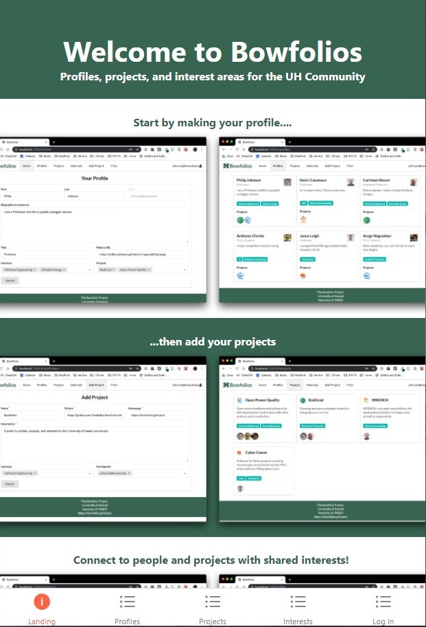
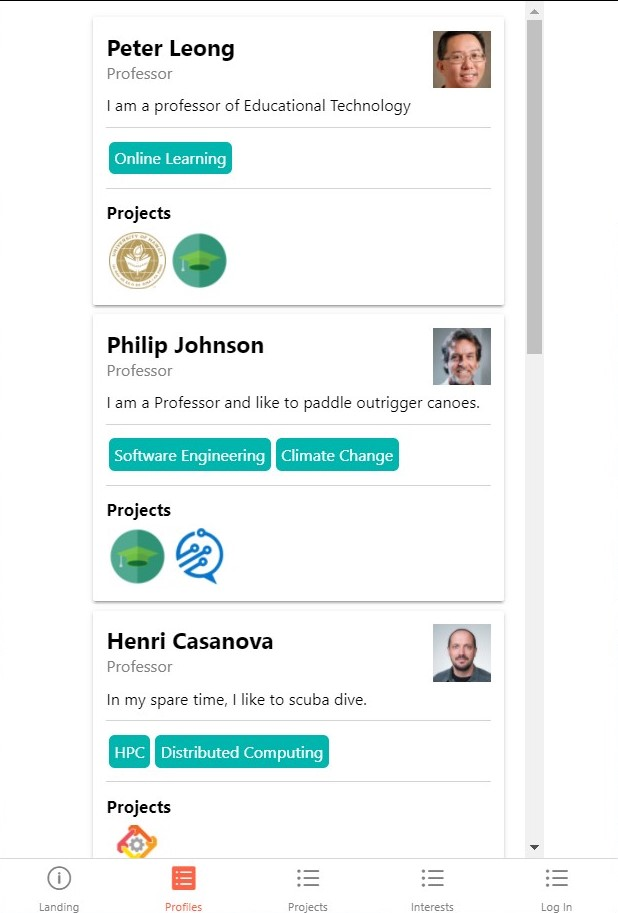
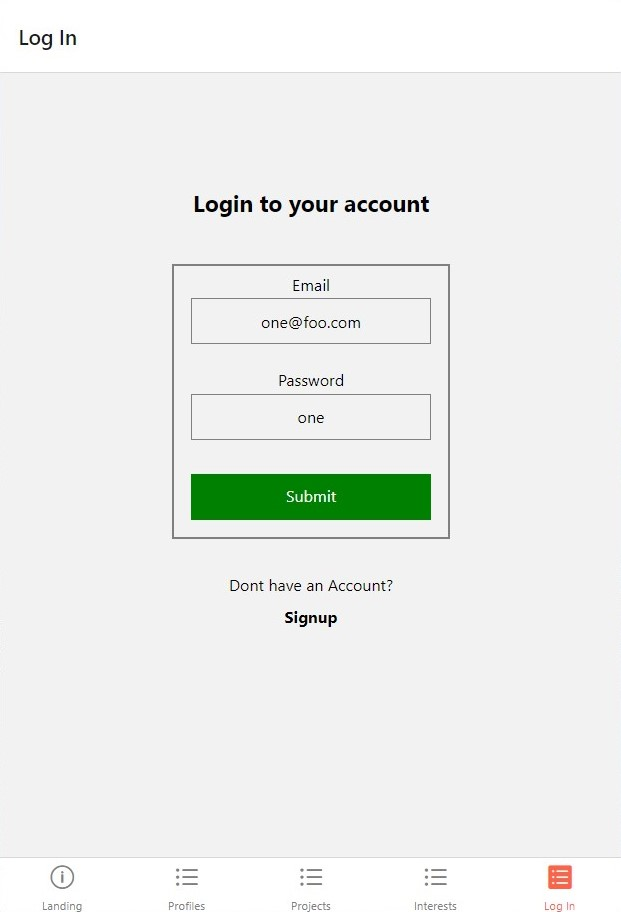
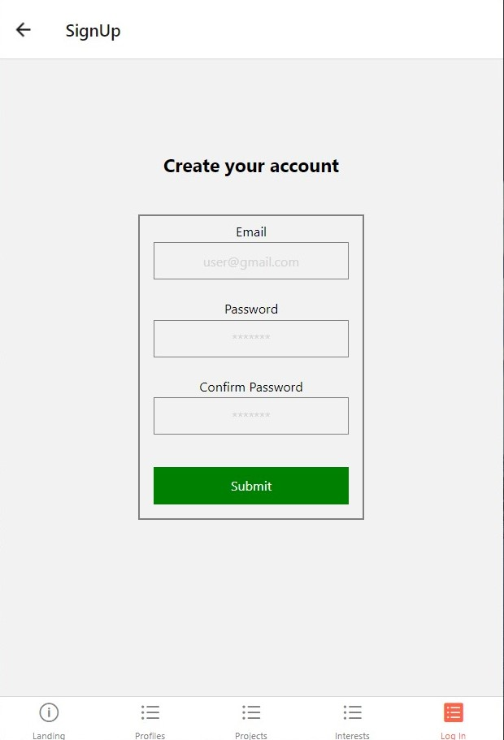

## Table of contents

* [Overview](#overview)
* [User Guide](#user-guide)
* [Developer Guide](#developer-guide)

## Overview

Bowfoliomobile is the mobile implementation of the BowFolios web application that provides pages to view and (in some cases) modify profiles, projects, and interests. We used [React Native Expo](https://expo.io/) to create the app.


## User Guide

This section provides a walkthrough of the Bowfolios user interface and its capabilities.

### Landing Page

The landing page is presented to users when they visit the top-level URL to the site.



### Index pages (Projects, Profiles, Interests)

Bowfolios provides three public pages that present the contents of the database organized in various ways.  Currently, only the Profiles page is implemented.

The Profiles page shows all the current defined profiles and their associated Projects and Interests:




### Sign in and sign up

Click on the "Login" button in the bottom right corner to go to the following page and login. You must have been previously registered with the system to use this option:



Alternatively, you can select "Sign up" to go to the following page and register as a new user.  Currently, this is only a mock-up:



// ### Home page

// After logging in, you are taken to the home page, which presents a form where you can complete and/or update your personal profile.  Currently, this is only a mockup:

// 


## Developer Guide

This section provides information of interest to Meteor developers wishing to use this code base as a basis for their own development tasks.

### Installation

First, [install Node.js](https://nodejs.org/).

Second, visit the [Bowfoliomobile application github page](https://github.com/Badcodio/bowfoliomobile), and click the "Code" button to create your own local repository initialized with a copy of this application. Alternatively, you can download the sources as a zip file.  However you do it, download a copy of the repo to your local computer.

Third, cd into the bowfoliomobile directory and install the expo command line tool with:

```
$ npm install expo-cli --global
```

Fourth, install the necessary libraries with:

```
$ expo install
```

Fourth, start the system with:

```
$ expo start
```

If all goes well, you will be taken to the Expo DevTools on your web browser which is running on a port on your localhost.  To run the app with live reloading you can:
 - run it on a mobile emulator
 - run it on your web browser
 - send a link to your phone with email.
 - scan the QR code with the Expo app (Android) or the Camera app (iOS).


